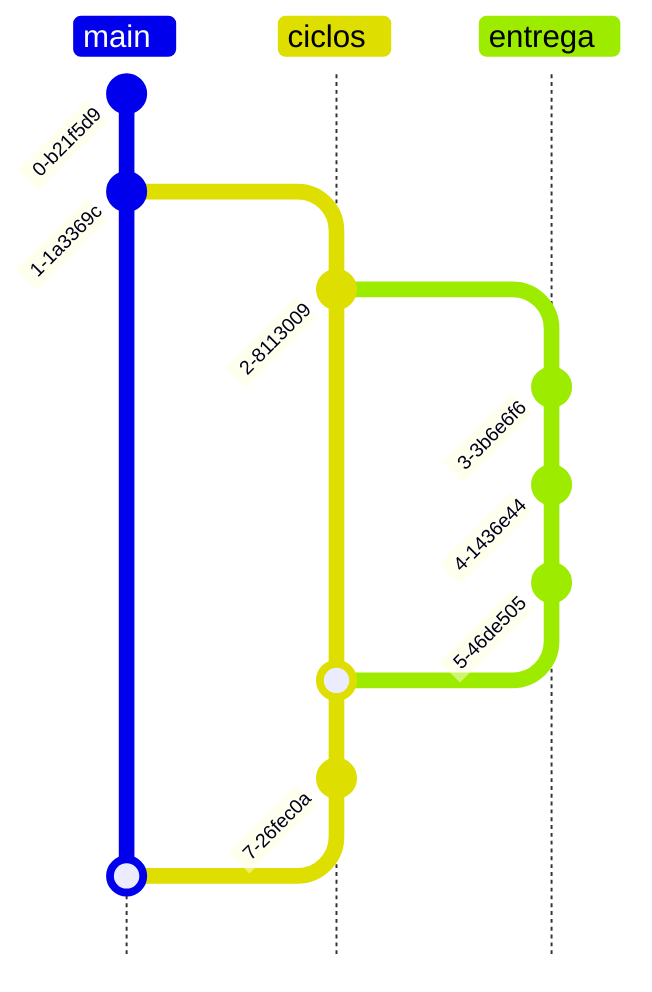

# Guia de Contribuição
**Agradeço seu interesse em contribuir com este repositório!**
Embora ele seja direcionado a um estudo individual, todas as contribuições são muito bem-vindas.

É importante mencionar que este projeto tem o fim de registrar conhecimentos adquiridos ao longo do programa de estágio da Cento Software. Cada arquivo com extensão `.md` guarda anotações que podem ser desenvolvidas ao longo do tempo, seguindo a filosofia do Digital Garden – [clique para conhecer](https://obsidian.rocks/creating-a-digital-garden-in-obsidian/).


### 💻📚 Como contribuir 

1. **Fork:** Crie um fork deste repositório em sua conta do GitHub.
2. **Clone:** Clone o fork em sua máquina.
3. **Crie um novo branch:** Crie um novo branch para cada nova feature ou correção de bug. 
4. **Faça suas alterações:** Edite os arquivos conforme necessário.
5. **Commit:** Faça commit das suas alterações, seguindo o padrão estabelecido.
6. **Push:** Envie suas alterações para o seu fork remoto.
7. **Crie um Pull Request:** Crie um Pull Request para o branch main do repositório, descrevendo as alterações.


## 📑📃 Convenções de Documentação   
A estruturação deste repositório de conhecimento ambiciona ser muito simples e intuitiva para o proprietário. Embora existam inúmeras técnicas de separação de arquivos, as normas seguidas aqui são particulares.

Nesse contexto, a fim de organizar e permitir um trabalho eficiente, foram estabelecidas algumas conveções de padronização, que devem ser seguidas, caso queira contribuir com este projeto.

---------------------------------------
### Markdown 📌
Para escrita de documentação, é utilizada a linguagem de marcação [Markdown](https://docs.github.com/pt/get-started/writing-on-github/getting-started-with-writing-and-formatting-on-github/basic-writing-and-formatting-syntax). Já a diagramação pode ser feita baseado no [Mermaid](https://mermaid.js.org/), que apresenta um [tutorial](https://github.blog/developer-skills/github/include-diagrams-markdown-files-mermaid/) para auxíliar a utilização, ou no [Astah](https://astah.net/products/astah-community/), ou no [Draw.io](https://app.diagrams.net/). Por fim, a criação de ilustrações é apoiada pela ferramenta [Excalidraw](https://excalidraw.com/).

-------------------------
### Gerência de Arquivos 📂📝
- As orientações a seguir são apenas inaugurais, logo, é possível que sejam alteradas, conforme desenvolvimento do programa de estágio. No entanto, qualquer detalhe modificado deve ser informado neste documento.
    - Todos os arquivos são organizados dentro de pastas no repositório do GitHub, usufruindo do controle de versionamento (GIT). 
    - Os nomes de diretórios e arquivos devem ser escritos em inglês, ou seguindo o nome próprio quando for o caso, com a nomenclatura Snake Case.
    - Deve haver, via de regra, apenas duas camadas de diretórios, podendo existir uma ou duas camadas a mais somente se for estritamente necessário.

    ```bash
    . programming_languages/
        _ javascript/
        _ typescript/
    ```
    - A primeira camada de pastas trata de assuntos maiores, baseados em sua maior parte nas displinas do curso de Engenharia de Software, da UFMS.
    - Já a segunda camadas de diretórios surge conforme demanda.
    - A nomeação de qualquer pasta e arquivo terá no máximo três palavras, de preferência substantivos estratégicos (palavras-chave, tags) que permitirão a busca por meio do atalho `Ctrl+f`.
    - Na nomenclatura, não é permitido números nem caracteres especiais além de `_` (*underline*).

------------

### Commits 💾🗒

Template da mensagem do commit:
```sh
<(tipo)>: <breve descrição>
<LINHA EM BRANCO>
<descrição maior>
<LINHA EM BRANCO>
<footer>
```

As mensagens devem seguir as seguintes orientações:
- O cabeçalho, presente na primeira linha do template, é obrigatório.
- As linhas do commit não podem ultrapassar o número de 100 caracteres.
- Os tipos previstos são: 
   - (feat): cria uma nova feature.
   - (fix): resolve um erro ou bug da aplicação.
   - (docs): adiociona documentação.
   - (correct): corrige detalhes na documentação já existente.
   - (update): incrementa informações significativas para documentação já existente.
- Se o tipo do commit não se encaixa em nenhum dos especificados, ele é omitido.
- A breve descrição explana o que o commit faz, logo, deve começar com um verbo conjugado na terceira pessoa do singular, no tempo presente do indicativo.
- A mensagem deve começar com letra minúscula e não deve terminar com ponto "."
- O footer é omitido se o commit não introduz uma BREAKING CHANGE, que deve ser escrito como `BREAKING CHANGE: <descrição>`.

--------------------
### Nomenclatura de Branches 🌿

Caso seja necessário criar uma branch, sua nomenclatura deve seguir as seguintes normas, que são inspiradas no Gitflow:s
- É preciso elaborar um label, em português, que resume o objetivo da criação da branch, também utilizando Snake Case. Exemplo: `ciclos`, `entrega/titulo_entrega_resumido`, `aprovacao/ciclo_numero`.
- O label _ciclos_ corresponde à branch _develop_, _entrega/_, à branch _feature_ e do padrão Gitflow. Não possui branch `release`. 



-------------------------
### Versionamento 🏗

A técnica de versionamento utilizada é uma releitura do [SemVer](https://semver.org/lang/pt-BR/), com adaptações para que se encaixe a um depósito de conhecimento.

Dado um número de versão MAJOR.MINOR.PATCH, incremente a:
- Versão Maior(MAJOR): quando fizer mudanças drásticas nos arquivos README.md e CONTRIBUTING.md que afetem todos (ou quase todos) os arquivos e diretórios,
- Versão Menor(MINOR): -------
- Versão de Correção(PATCH): quando corrigir falhas pontuais na estrutura e nas padronizações.

---------
### Pull Request

Inicialmente, haverá apenas uma branch para alterações que serão feitas ao longo de um ciclo (uma semana). Após a aprovação do supervisor, será feito o merge das alterações para a branch master, por meio de pull request.

A seguir, um template para os pull requests.

```
<!-- Descreva o objetivo das alterações propostas. Explique o que foi modificado e por que é importante de modo sucinto. -->

## Checklist
Confira se o PR se as padronizações:
- [ ] As mensagens de commit seguem as normas do CONTRIBUTING.md.
- [ ] As alterações foram revisadas e estão prontas para aprovação do supervisor?

## Tipos de Alterações
Que tipos de alterações foram feitas?

- [ ] Finalização de um ciclo;
- [ ] Finalização de uma entrega;
- [ ] Melhorias na documentação;
- [ ] Melhorias na organização do repositório.

## Qual é o estado atual?

## Como é o novo estado?

```


