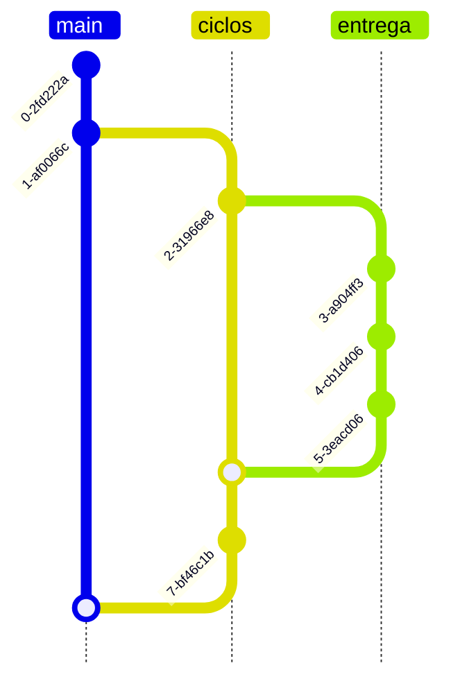

# Guia de Contribuição
**Agradeço seu interesse em contribuir com este repositório!**
Embora ele seja direcionado a um estudo individual, todas as contribuições são muito bem-vindas.

É importante mencionar que este projeto tem o fim de registrar conhecimentos adquiridos ao longo do programa de estágio da Cento Software. Cada arquivo com extensão `.md` guarda anotações que podem ser desenvolvidas ao longo do tempo, seguindo a filosofia do Digital Garden – [clique para conhecer](https://obsidian.rocks/creating-a-digital-garden-in-obsidian/).


### 💻📚 Como contribuir 

1. **Fork:** Crie um fork deste repositório em sua conta do GitHub.
2. **Clone:** Clone o fork em sua máquina.
3. **Crie um novo branch:** Crie um novo branch para cada nova feature ou correção de bug. 
4. **Faça suas alterações:** Edite os arquivos conforme necessário.
5. **Commit:** Faça commit das suas alterações, seguindo o padrão estabelecido.
6. **Push:** Envie suas alterações para o seu fork remoto.
7. **Crie um Pull Request:** Crie um Pull Request para o branch main do repositório, descrevendo as alterações.


## 📑📃 Convenções de Documentação   
A estruturação deste repositório de conhecimento ambiciona ser muito simples e intuitiva para o proprietário. Embora existam inúmeras técnicas de separação de arquivos, as normas seguidas aqui são particulares.

Nesse contexto, a fim de organizar e permitir um trabalho eficiente, foram estabelecidas algumas conveções de padronização, que devem ser seguidas, caso queira contribuir com este projeto.

---------------------------------------
### Markdown 📌
Para escrita de documentação, é utilizada a linguagem de marcação [Markdown](https://docs.github.com/pt/get-started/writing-on-github/getting-started-with-writing-and-formatting-on-github/basic-writing-and-formatting-syntax). Já a diagramação pode ser feita baseado no [Mermaid](https://mermaid.js.org/), que apresenta um [tutorial](https://github.blog/developer-skills/github/include-diagrams-markdown-files-mermaid/) para auxíliar a utilização, ou no [Astah](https://astah.net/products/astah-community/), ou no [Draw.io](https://app.diagrams.net/). Por fim, a criação de ilustrações é apoiada pela ferramenta [Excalidraw](https://excalidraw.com/).

-------------------------
### Gerência de Arquivos 📂📝
A organização que desenvolvemos ataca alguns problemas que são listados abaixo. Importante mencionar que todos os arquivos usufruem do controle de versionamento (GIT).

1. Desenvolvemos um método para organizar conhecimentos novos de maneira rápida, para não esquecê-los e para que eles sejam melhor detalhados posteriormente.
2. Separar os arquivos entre diretórios não é prático, pois vários temas têm alta relação com mais de um diretório, e essas relações ficam suprimidas se não tiverem links para outros arquivos.
3. Em certos casos, é desejável direcionar a leitura de um documento para um título específico em outro documento, o que não é viável no estado atual.
4. Colocar arquivos executáveis – geralmente de exercícios – dentro de um diretório junto com os documentos `.md` dificulta o acesso e a execução do código dos exercícios 

- Para tanto, apresentamos a seguinte **Solução** 🧪

**1.** A fim de garantir que novos conhecimentos sejam incluídos no repositório, mesmo em momentos offline, foi adotado o uso de um arquivo chamado `temporary.md`, na raiz do projeto. Tal arquivo deverá guardar temporariamente tópicos e links com referências para serem adicionados ao repositório. 
> O `temporary.md` é onde ficam as sementes. 🫛

**2.** Os documentos `.md` com conteúdo didático serão melhor distribuídos. No diretório raiz haverá três diretórios centrais: `./exercises`, `./content`, e `./media`, tendo como inspirações jardins digitais como o do [Steph Ango](https://stephango.com/). 
> Esses 3 são as espécies de plantas 🍅🫘🌳

<div align="center"></div>

- `./media` é onde ficarão todas as figuras e vídeos (arquivos `.png`, `.jpg`, `.mp4` etc) utilizadas no `./content`.
- Dentro de `./content` ficarão todos os atuais diretórios, exceto os de exercícios. Cada diretório será transformado em um arquivo de texto (`.md` ou `.ipynb`).
- Ao longo do desenvolvimento do repositório pode acontecer que, dentro de um documento, um tema comece a crescer muito e precise de um arquivo exclusivo. Se isso ocorrer, o tema pode ser movido para um documento separado e continuar seu crescimento normalmente. Um exemplo disso seria o futuro arquivo `advanced_dev_tech.md`; se houver um tópico sobre `frameworks`, esse tema pode ficar muito extenso, precisando dessa mudança.
- Entende-se por "tema extenso" aquele que gerar três níveis de títulos ou mais (`# > ## > ###`).
- Links: a gestão de links é melhor explicada na Parte III, porém, resumidamente, além dos tópicos relacionados, logo no cabeçalho deve haver um sumário, utilizando a notação markdown `[topico](##topico-citado-um)`.
- Os nomes de diretórios e arquivos devem ser escritos em inglês, ou seguindo o nome próprio quando for o caso, com a nomenclatura Snake Case. 
```bash
. programming_languages/
    _ javascript/
    _ typescript/
```

**3.** Para este aspecto do problema, devem ser utilizados links entre documentos e títulos.
- No cabeçalho de cada documento markdown ou notebook jupyter, precisa haver um sumário com links. Isso pode ser feito utilizando a notação comum, por exemplo, `[Tópico](##topico-citado-um)`. 
- Ao longo da escrita, certos assuntos podem ser referenciados, apontando para outros documentos dentro do jardim, ou outros temas dentro do mesmo arquivo, o que pode ser implementado com os [Wikilinks](https://foambubble.github.io/foam/user/features/wikilinks.html) da ferramenta [Foam](https://github.com/foambubble/foam). Os notebooks Jupyter podem receber [Metadados](https://jupyterbook.org/en/stable/content/metadata.html). Tal solução aprimora a busca e as conexões de conhecimento.
- Além dos wikilinks devem ser usadas as [Tags](https://foambubble.github.io/foam/user/features/tags.html) a fim de facilitar a busca de temas específicos utilizando o [Tag Explorer](https://foambubble.github.io/foam/user/features/tags.html#using-tag-explorer).
> Os links são as redes de micorrizas que conectam as plantas. 🍄‍🟫

**4.** Arquivos de exercícios ficarão no diretório `./exercises` sem subidivisões. O tema do exercício deve ficar específicado no nome do arquivo, porém a linguagem fica a cargo da extensão, p. ex. `.js`, ou `.ts`, ou `.py`.
- A nomeação de qualquer pasta e arquivo terá no máximo três palavras, de preferência substantivos estratégicos (palavras-chave, tags) que permitirão a busca por meio do atalho `Ctrl+f`.
- Na nomenclatura, não é permitido números nem caracteres especiais além de `_` (*underline*).

Com isso, evitamos os seguintes **Riscos** ☣️☢️:
A ausência de padronizações estruturais, ao longo do tempo, pode tornar o repositório de conhecimento quase inutilizável, ou inacessível.

------------
### Commits 💾🗒

Template da mensagem do commit:
```sh
<(tipo)>: <breve descrição>
<LINHA EM BRANCO>
<descrição maior>
<LINHA EM BRANCO>
<footer>
```

As mensagens devem seguir as seguintes orientações, que seguem a analogia de jardins:
- O cabeçalho, presente na primeira linha do template, é obrigatório.
- As linhas do commit não podem ultrapassar o número de 100 caracteres.
- Os tipos previstos são: 
   - `(seeding)`: adiociona conteúdo ao `temporary.md` para melhor tratamento no futuro.
   - `(watering)`: incrementa informações significativas para documentação já existente, _para que o jardim cresça bem_.
   - `(tidying)`: corrige detalhes na documentação já existente, isto é, _organiza melhor as plantinhas_.
- Se o tipo do commit não se encaixa em nenhum dos especificados, ele é omitido.
- A breve descrição explana o que o commit faz, logo, deve começar com um verbo conjugado na terceira pessoa do singular, no tempo presente do indicativo.
- A mensagem deve começar com letra minúscula e não deve terminar com ponto "."
- O footer é omitido se o commit não introduz uma BREAKING CHANGE, que deve ser escrito como `BREAKING CHANGE: <descrição>`.

--------------------
### Nomenclatura de Branches 🌿

Caso seja necessário criar uma branch, sua nomenclatura deve seguir as seguintes normas, que são inspiradas no Gitflow:s
- É preciso elaborar um label, em português, que resume o objetivo da criação da branch, também utilizando Snake Case. Exemplo: `ciclos`, `entrega/titulo_entrega_resumido`, `aprovacao/ciclo_numero`.
- O label _ciclos_ corresponde à branch _develop_, _entrega/_, à branch _feature_ e do padrão Gitflow. Não possui branch `release`. 


```mermaid
gitGraph TB:
    commit
    commit
    branch ciclos
    commit
    branch entrega
    commit
    commit
    commit
    checkout ciclos
    merge entrega
    commit
    checkout main
    merge ciclos
```

-------------------------
### Versionamento 🏗

A técnica de versionamento utilizada é uma releitura do [SemVer](https://semver.org/lang/pt-BR/), com adaptações para que se encaixe a um depósito de conhecimento.

Dado um número de versão MAJOR.MINOR.PATCH, incremente a:
- Versão Maior(MAJOR): quando fizer mudanças drásticas nos arquivos README.md e CONTRIBUTING.md que afetem todos (ou quase todos) os arquivos e diretórios,
- Versão Menor(MINOR): -------
- Versão de Correção(PATCH): quando corrigir falhas pontuais na estrutura e nas padronizações.

---------
### Pull Request

Inicialmente, haverá apenas uma branch para alterações que serão feitas ao longo de um ciclo (uma semana). Após a aprovação do supervisor, será feito o merge das alterações para a branch master, por meio de pull request.

A seguir, um template para os pull requests.

```
<!-- Descreva o objetivo das alterações propostas. Explique o que foi modificado e por que é importante de modo sucinto. -->

## Checklist
Confira se o PR se as padronizações:
- [ ] As mensagens de commit seguem as normas do CONTRIBUTING.md.
- [ ] As alterações foram revisadas e estão prontas para aprovação do supervisor?

## Tipos de Alterações
Que tipos de alterações foram feitas?

- [ ] Finalização de um ciclo;
- [ ] Finalização de uma entrega;
- [ ] Melhorias na documentação;
- [ ] Melhorias na organização do repositório.

## Qual é o estado atual?

## Como é o novo estado?

```


