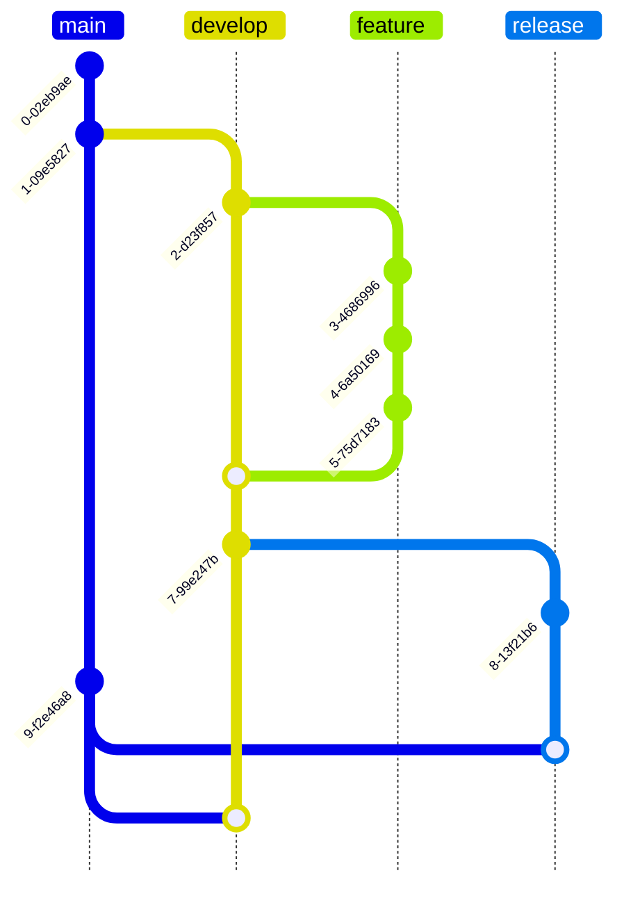

# Git Flow 🔴🠒🟢

Foi criado em 2010 pelo holandês Vincent Driessen. Trata-se de uma estratégia de workflow utilizada para organizar o versionamento de código no repositório, mantendo a segurança. Para compreendê-lo mais  facilmente, é possível visualizá-lo como uma árvore e seu ramos, isto é, um grafo.

A branch master é a faz o intermédio entre o repositório e o servidor de produção. Como não é recomendado fazer commit de correção de bugs diretamente na master, são criadas algumas branches. Nessa perspectiva, o intuito do Git Flow é evitar conflitos quando há vários programadores trabalhando no mesmo projeto. Então, sempre que é necessário adicionar uma feature ou corrigir um bug, cria-se uma branch (ramificação).

Depois que as alterações nas branches são totalment testadas, é feito merge com a master. O Git Flow prevê dois tipos de branches: a principal (master e develop) e as de suporte (feat, release e hotfix). A branch master fica para envio de todas as novas features. Então a develop é criada a partir da Master e ela precisa ter todas as features estáveis uma branch de release. Já as branches de features são criadas a partir da Develop.

Sobre a nomenclartura, é importante anotar que quase todas as estratégias de branching usam uma padronização do tipo `feature/nome-da-feature`. A branch release vai acumulando as features até que se possa lançar uma nova versão para a master com merge. A partir disso, a master recebe uma nova tag de versão.

Há ainda a branch hotfix, também feita a partir da master. O propósito dela é corrigir bugs. Após testado, o merge dela é feito diretamente na master, estreando também uma nova tag. Ao término de tal procedimento, a brach hotfix deve ser removida. Enquanto isso, a branch develop deve estar sempre atualizada com a master.

Algumas críticas ao Git Flow mencionam complexidade e burocracia. Além disso, defendem que é insustentável, ineficaz, que o próprio criador não recomenda o Git Flow atualmente e que o git Flow gera merges automáticos com resolução de conflitos e commits inúteis.

A seguir, uma ilustração que ajuda a compreender o Git Flow.

