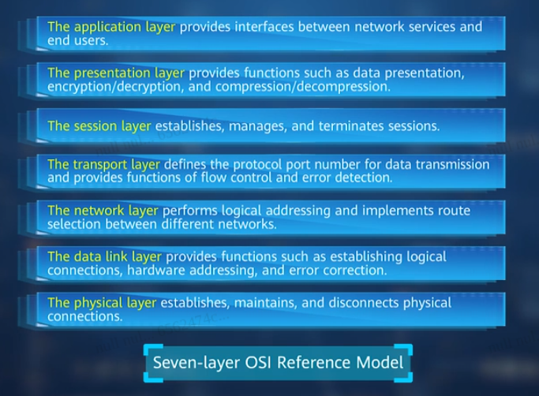
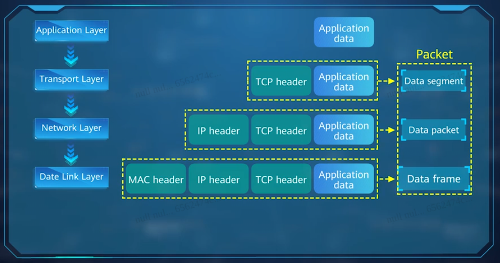

# Sumário
- [Redes de Computadores](#redes-de-computadores)
- [Proxy](#proxy)
- [Protocolo HTTP](#protocolo-http-)
- [Protocolos de Rede](#protocolos-de-rede-)
- [Cabos](#cabos---comunicação-física)
- [Firewall](#firewall)
- [Algoritmos de Roteamento](#algoritmos-de-roteamento)

# Anotações Introdutórias 🌐🪄
- Rede é um conjunto de coisas interconectadas.
- Toda máquina conectada à rede é um **host**. Também é qualquer coisa que usa o TCP/IP.
- LAN (Local Area Network): sua casa, uma faculdade, uma pequena empresa.
- WAN (Wide Area Network): é difícil determinar o que é algo amplo.
- [RNP (Rede Naciona de ensino e Pesquisa)](https://www.rnp.br/): é uma rede brasileira para educação e pesquisa, tendo o objetivo de impulsionar a ciência e a educação para todos.
- Roteador: dispositivo que abre mais camadas e possibilita melhor controle. Ele consegue alcançar múltiplas redes, e segmentá-las.
- Estação de Trabalho: geralmente são computadores. É onde vc vai trabalhar.
- Servidor: é quem hospeda serviços de rede. Eles têm uma configuração de hardware bem mais robusta. Há vários tipos: de arquivo, de e-mail, de impressão, web, de aplicação, de acesso remoto, e de proxy.
- WPA2 Enterprise: é um protocolo diferente para logar na rede (Eduroam, p. ex.). É diferente do que a gente usa em casa, pq em casa é uma senha compartilhada, aqui na UFMS é diferente.
- Rede Blackbone:
- o SEI e o SisCad são os serviços mais indispensáveis da UFMS.
- Há dois tipos de redes: **peer-to-peer (P2P)** e **cliente-servidor**.
- **Hub**: cada pacote enviado para uma porta é copiado para todas as outras. Ele é dispositivo mais estúpido da Rede de Computadores.
- Não pode misturar cabos elétricos com cabos de rede comuns por causa do campo elétromagnético.
- **Backbone**: é uma conexão física entre todos os hosts (segmentos e servidores) na rede.
- ESR: é uma escola de redes de computadores. Eles têm um modelo de prática de rede.
- **Encapsulamento:** é a comunicação entre as camadas adjacentes do protocolo OSI.
- **Repetidores** são uma porcaria.
- Topologias:
    - **Barramento**: é a topologia mais básica. Ninguém usa mais.
    - **Estrela**: é usada até hoje. Coloca um switch e liga todo mundo nele.
    - **Anel**: tem o formato de um ciclo. Esse aqui ninguém usa mais. 
    - **Malha**: cada host fica ligado em todas as máquinas. `[n*(n-1)]/2` para saber o número de cabos pra cada máquina.
    - **Ponto-a-ponto/Ponto-a-Multiponto**: a conexão é direta, um dispositivo ligado diretamente a outro 
-**DNS**: é um sistema distribuído e hierarquico. Há dois tipos de domínio: os de primeiro nível e de segundo nível. Os de 1o nível são os dos países, os ccTLDs. Os de 2o nível são os autoritativos, p. ex., `.com`, `.org`, `.bio`, `.edu`.
- Uma rede com poucos dispositivos tem tempo de resposta mais rápido no acesso a recursos de rede.
- Redes muito grandes sofrem com problemas de broadcast e competição por acesso a recursos.
- **KISS** - Keep It Simple Stupid
- A **internet** é uma WAN distribuída.
- Há dois tipos de redes P2P (Par-a-par) e Cliente-Servidor.
- Numa rede P2P os computadores não têm nenhum dispositivo central ou com autoridade especial. Todos são pares.
- A rede Cliente-Servidor é o oposto da P2P. Ela facilita a aplicação de conceitos de segurança e também a localização de arquivos.
- **Topologia Lógica** mostra como os dados "se movem" na rede: barramento, estrela, anel, malha, ponto-a-ponto, ponto-a-multiponto, híbrida.
- **Ponto-a-Multiponto** é a conexão entre uma interface de um roteador a múltiplos roteadores destino.
- **Backbone** é onde estão conectados os segmentos de rede. É o ponto comum de conexão de todos os segmentos.
- O **NAT** é um processo de tradução de um endereço IP 
- 

## Proxy

- Usado para averiguar e controlar as coisas que as pessoas podem acessar na rede.
- armazena em disco as coisas mais acessadas pelo conjunto de usuários.
- acelera acesso a serviços de rede utilizando o processamento local.
- 

## Criptografia
Há duas formas de criptografia:
  - Simétrica: a chave do wi-fi é simétrica, porque todo mundo acessa a mesma.
  - Assimétrica: sei lá.

# Protocolo HTTP 📄🛜
- A porta dele é a 80.
- O protocolo que ele usa é a HTTPS.

**API**: Application Programming Interface. Têm fácil integração com os sistemas; seguem padrões de desenvolvimento; elas se comunicam com xml, ou json, ou html, devido à simplicidade desses tipos de dados; requests e responses são feitas em HTTP 📄 tipos de requisições HTTP: get, post, delete, put, patch; uma API RESTful é algo ideal;

**ENDPOINT**:  é uma URL da API, que acessamos para obter uma resposta; ponto final, é o que fica na ponta da rede (roteadores, switch, celulares, tablets etc); Endpoint é um termo que se refere a cada rota de uma API. Através dele é possível solicitar criação, exclusão, atualização e recuperação de qualquer dado.

**BODY**: é o corpo da requisição que é enviado para o endpoint. Ele armazena os dados compilados  para criação ou atualização de algum serviço, usualmente no formato JSON ou XML.

**PARAMS**: são utilizados nas consultas ou atualizações de serviços. Eles podem ser parâmetros enviados na própria URL, após o sinal `?` (query params), posicionados na rota como em `/projects/:project_id` (route params), ou enviados no body da requisição. Existe uma tecnologia experimental com desejo de padronizar os parâmetros, veja [ URL Pattern API](https://developer.mozilla.org/en-US/docs/Web/API/URL_Pattern_API).

**REST**: é um conceito de arquitetura ligado à API e ao protocolo HTTP. Esse padrão tem 6 partes que precisam ser implementadas para tornar a API em RESTful uniformidade, desacoplação, stateless, cache, arquitetura de camadas, code on demand.

O Postman, o Bruno e o [Ensomnia](https://insomnia.rest/) são programas que utilizamos para testar APIs suas ou de terceiros. Você insere um endpoint, para testar o backend e depois integra com o frontend. Ele serve para você não precisar do frontend para testar o backend.

**LOCALHOST**: é um nome que identifica um dispositivo numa rede (hostname), e refere-se ao endereço IP padrão da rede do computador local (`127.0.0.1`), isto é, o próprio computador em que um programa é executado. Dessa maneira, o computador funciona como um servidor virtual. Cada endereço de IP está conectado a uma placa de rede, mas o localhost é como se fosse uma placa de rede virtual. O `0.0.0.0` significa `qualquer placa de rede`.

**PROMISE**: trata-se de um proxy para um valor não necessariamente conhecido quando uma promise é criada. Permite que métodos assíncronos retornem resultado constantemente.

- **Sockets**: soquetes são como tomadas. Diferentes portas são diferentes padrões de tomadas. Soquetes é uma forma de comunicação entre processos.
- **Bind**: é uma ligação -- a ligação de um endereço IP com outro número de 16 bits, que é a porta.
- **Porta**: é um número que identifica um processo que identifica um processo que o sistema operacional mantém na tabela dele. É um identificador do programa rodando ligado ao endereço IP do computador. É só um número
- **Listen**: é um estado em que o programa fica bloqueado esperando o sistema enviar algo.
 
O browser é um exemplo de programa que pede uma conexão. Ele não precisa fazer bind porque ele não precisa que ninguém se conecte nele.
Um servidor faz bind e listen numa porta e fica esperando (escutando). Um cliente (navegador) enviar pacotes para o IP do servidor e pede para se conectar com um programa que está escutando.

Para programas web, geralmente utilizamos porta que vão de 1024 até 49152. As portas de número até 1023 são reservadas e precisam de permissão de administrador `sudo` para serem utilizadas.

# Protocolos de Rede 📄
- `~$ telnet smtp.google.com 25`
- Função de hash. Dependendo da entrada, a resposta é sempre de um tamanho específico. Exemplo `X % 10` é um exemplo de função de hash.
- Você precisa conhecer pelo menos um algoritmo de busca em rede. 
- Estude o algoritmo do **Dijkstra**.
- A gente envia número com little-engine para a rede, mas antes disso o sistema precisa converter para big-engine.
- Three-Way Handshake: SYN > SYN/ACK > ACK
- **Protocolo** é um conjunto de regras para computadores e outros dispositivos conversarem entre si.
- **MAC**: ele é um número de 48 bits, 08-00-20-0A-8C-6C

## OSI - Open System Interconnection 🪄🛜
- Cada camada não tem conhecimento da camada anterior.
- Foi criado em 1970

- Listagem das camadas, a seguir:

Three-Way Handshake:
- Um emissor envia o SYN
- O Receptor devolve SYN/ACK
- Daí o emissor retorna o ACK.
- A conexão foi estabelecida.

# Física
- representado por algo que possa expressar 0s e 1s.

# Enlace de dados
- se refere às tecnologias usadas para conectar duas máquinas em uma rede onde a camada física já existe. 
- Ela gerencia quadros de dados, que são sinais digitais encapsulados em pacotes de dados. 
- O controle de fluxo e o controle de erros de dados geralmente são os principais focos da camada de enlace de dados.
- Faz a transmissão dos quadros de dados; converte bytes em quadros; usa endereço **MAC**.
- Transporta dados entre dois dispositivos de rede.

# Rede
- parte mais difícil. 
- A camada de rede se preocupa com conceitos como roteamento, encaminhamento e endereçamento em uma rede dispersa ou em várias redes conectadas de nós ou de máquinas. 
- A camada de rede também pode gerenciar o controle de fluxo. Faz o roteamento dos dados na rede; é tipo um GPS. 
- Determina o endereço lógico (IP) de cada equipamento e o melhor caminho para chegar ao destinho. 
- Usa algoritmos de roteamento.
- transporta os pacotes de um host para o outro

# Transporte
- tem os protocolos TCP (garante a eficácia da comunicação) e UDP (é menos confiável). 
- Entrega de informações de forma confiável ou não. 
- O foco principal da camada de transporte é garantir que os pacotes de dados cheguem na ordem correta, sem perdas nem erros, ou que possam ser recuperados sem complicações, se necessário. 
- O controle de fluxo, em conjunto com o controle de erros, é frequentemente um foco na camada de transporte. 
- Nessa camada, os protocolos comumente usados ​​incluem o Transmission Control Protocol (TCP), um protocolo baseado em conexão quase sem perdas, e o User Datagram Protocol (UDP), um protocolo sem conexão com perdas. Percorre o caminho determinado pela camada de rede.
- transporta mensagens da camada de aplicação de um processo para o outro.
- Pega uma mensagem da camada de aplicação e inclui algumas informações adicionais dentro dessa mensagem para criar uma nova unidade de protocolo.

# Sessão
- A camada de sessão é responsável pela coordenação de rede entre duas aplicações separadas em uma sessão. 
- Uma sessão gerencia o início e o término de uma conexão individual de aplicações e conflitos de sincronização. 
- Estabele, gerencia e encerra sessões de interação. 
- Garante o controle de diálogo e comunicação.

# Apresentação
- é onde acontece a codificação.
- Se preocupa principalmente com a sintaxe dos próprios dados para as aplicações enviarem e consumirem. 
- Lida com a representações dos dados, sendo responsável por sintaxe e semântica das informações. 
- Isso pode incluir a compressão ou a criptografia de dados.

# Aplicação
- acesso de fato aos dados pelo usuário. 
- Interface, browser. É onde ficam os programas tradicionais, FTP (usado apenas para transferência de dados), TFTP (maneira Trivial de TFTP). 
- Oferece suporte a **HTTP, IMAP, SMTP E DNS**. São serviços que controlam o envio e o recebimento de mensagens.
- A camada de aplicação se preocupa com o tipo específico da aplicação em si e seus métodos de comunicação padronizados. Por exemplo, navegadores podem se comunicar usando HyperText Transfer Protocol Secure (HTTPS), e clientes de e-mail e HTTP podem se comunicar usando POP3 (Post Office Protocol versão 3) e SMTP (Simple Mail Transfer Protocol).

# TCP/IP 📡
- **Aplicação:** apresentação, aplicação e sessão.
- **Transporte:** transporte.
- **Internet:** rede.
- **Acesso a dados:** enlace e física.

# Cabos - Comunicação Física
- Cabo coaxial: é o mais antigão. Um usa PVC, outro usa cerâmica, ou pode ser de teflon também. Ele tem uma blindagem que evita interferência eletromagnética.
- Par trançado: muito utilizado em empresa. É o mais barato.
- Fibra ótica: aquele que usa uma fibra transparente que se aproveita do fenômeno da refração da luz. Não sofre de interferência.
- half-duplex: cada um fala de uma vez;
- full-duplex: podem falar ao mesmo tempo.
- Cabo Ethernet: são 4 pares com as cores: verde, verde-branco, azul, azul-branco, laranja, laranja-branco. e marrom, marrom-branco.

- Conversor de mídia: é um dispositivo que converte um tipo de sinal em outro. P. ex.: o access point, que converte as ondas eletromagnéticas em sinais elétricos. 
- Tem um negócio chamado **Powerline**, que se conecta na tomada. É uma boa alternativa para repetidores, já que repetidores são uma bosta.

# Firewall
- Mecanismo da rede que faz com que todo tráfegode saída ou de entrada é feito através de uma ponte elevadiça (o firewall). 
- Ele atua como um filtro de pacotes, inspecionado todo pacote que entra e sai das LANs, de acordo com algum critério formulado formulado pelo adm.
- O firewalls são vulneráveis também porque eles violam a separação de camadas, dos protocolos de rede. Eles agem na camada de rede, porém precisam analisar as camadas de transporte e de aplicação.
- A fraqueza do firewall é que os administradores da rede desejam segurança, mas não podem cortar a comunicação com o mundo exterior.
- A DMZ (Zona Desmilitarizada) é uma parte da rede da empresa que se encontra fora da segurança. Então, os computadores acessam a internet por aí, mas os firewalls impedem a entrada de qualquer coisa estranha pela porta 80.
- Firewall stateless: tem que existem uma regra do firewall falando.  
- Firewall statefull: é mais esperto, porque ele faz uso da comunicação TCP. 
- DHCP (Dynamic Host Configuration Protocol): o protocolo de configuração dinâmica de host serve para configurar os hosts com suas informações básicas, atendendo ao ARP e outros protocolos da internet.  

# Algoritmos de Roteamento
O conjunto de decisões que determinam por onde o pacote trafega é o que constitui o roteamento, que envolve a aprendizagem de caminhos, recebimento de pacotes e encaminhamento de pacotes.

# Algoritmo RIP
- É um protocolo baseado em inundação.
- É preciso dizer exatamente como a rede está sendo inundada.
- Tem umas tabelas pra preencher.
- Cada um dos roteadores tem uma tabela local.
- Tem alguma coisa que é a gente que define a ordem, e que precisa ser explicitado no exercício, para que a resposta final seja avaliada.
- Tem 3 fases:
  - Criação de Tabelas de Roteamento;
  - Troca de mensagens;
  - Atualização

## Algoritmo CSMA/CD para Gerenciamento de Colisões
- Se o host detectar algum sinal no cabo, ele envia um **jam** para todos os hosts, para que todos parem de enviar sinal.
- Então os hosts respondem ao sinal de **jam** esperando um tempo aleatório antes de tentar transmitir de novo.
- Se as colisões continuarem após 15 tentativas, os hosts que estão tentando transmitir emitem um _time out_. 
- Todos os hots têm a mesma prioridad epara transmitir depois que o tempo expirar.

## Algoritmo OSPF - Open Shortest Path First
- É usado para encontrar dinamicamente todas as redes e garantir que os roteadores tenham a mesma tabela de roteamento.
- O objetivo é colocar em ordem crescente os caminhos possíveis para um pacote percorrer partindo de cada roteador até que todos os IPs estejam acessados.

## Enderaçamento IP e Sub-Redes (IPv4 e IPv6)
- Dado um endereço IP com uma máscara, seguindo a notação CIDR (p. ex. /28) ou decimal (p. ex. 255.255.255.240)
- O endereço de **broadcast** é o último endereço da faixa, enquanto que o **endereço da rede** é o primeiro endereço da faixa.
- O intervalo de Hosts Válidos são o primeiro e o último IP que podem ser atribuídos a dispositivos da rede.
- Também é possível calcular o número de dispositivos possíveis dentro de uma sub-rede, usando a fórmula **_(2^n - 2)_**, onde _n_ é o número de bits do host.
- É possível saber, ainda, o número de sub-redes que uma máscara pode comportar a partir de uma rede maior.
- Outra coisa é poder saber também a qual sub-rede um host pertence.
- Preciso saber os intervalos padrão e as máscaras padrão também, tem os endereços **A, B e C**, além das subredes sem classe. 
	- Classe A: 1.0.0.0 a 126.255.255.255   /8
	- Classe B: 128.0.0.0 a 191.255.255.255  /16
	- Classe C: 192.168.0.0 a 223.255.255.255  /24

- **APIPA** intervalo 169.254.0.0/16 é usado quando um host não consegue obter um IP de um servidor DHCP.
- 127.0.0.1 (IPv4) e ::1 (IPv6), usados para testar a pilha TCP/IP local.
- Broadcast de camada 2: **FF:FF:FF:FF:FF:FF**, endereço MAC.
- Broadcast de camada 3: Endereço com todos os bits de host em 1 (ex: 192.168.1.255 para a rede 192.168.1.0/24).
- Loopback: 127.0.0.1 (IPv4) e ::1 (IPv6), usados para testar a pilha TCP/IP local.

- IPv6 tem **128 bits** no formato hexadecimal.
- Usa-se `::` como abreviação para sequência de zeros.
- Tipos de endereço: unicast (um-pra-um), multicast (um-pra-muitos), anycast (um-para-o-mais-próximo)
- Troubleshooting: identificar problemas de configuração, como máscara de sub-rede errada ou um gateway padrão que não pertence à mesma subrede.
- O IP tem 32 bits.
- A **máscara da rede** é a regrinha rede, que é aquilo que determina quantos dígitos estou usando para representar a rede e quantos dígitos estou usando para representar os hosts. Com isso posso descobrir o intervalos de redes IP que compoem uma rede.
- Para saber o número de intervalos para subredes, dado a máscara da rede. Basta eu ver o número de bits utilizados para hosts, e então começo a somar para ver os intervalos. Se forem usados 32 bits para hosts, então o primeiro intervalo é 0 -> 31. Daí eu vou somando e a sequência fica a seguinte: 0 -> 31, 32 -> 63, 64 -> 95 e assim vai. Tu vai somando o início do intervalo com 32, que é o número de hosts. E daí você faz isso até chegar na soma anterior ao 255, porque o 255 será o final do intervalos do ultimo intervalo de subrede possível.
- Para encontrar o intervalo de um IP, você pega o último octeto e olha em qual intervalo ele pode estar.

## Protocolos de Roteamento (IGP e EGP)
- **Vetor de Distância (Distance-Vector)**: roteadores informam aos vizinhos sobre as redes que conhecem. É propenso a loops. RIPv1, RIPv2, IGRP
- **Estado de Enlace**: roteadores conhecem a topologia completa da rede e calculam o melhor caminho independetemente. Ex.: **OSPF** - Protocolo padrão da indústria, escalável, usa o conceito de áreas.
- **Híbrido/Vetor de Distância Avançado**: combina as características dos dois. Ex.: EIGRP
- **Protocolo de Gateway Exterior (EGP)**: exemplo: o BGP é o protocolo que move a internet.

1. Entenda as Diferenças: Foque nas diferenças conceituais:
- Hub vs. Switch vs. Roteador (domínios de colisão e broadcast).
- RIP vs. OSPF vs. BGP (vetor de distância vs. estado de enlace, IGP vs. EGP).
- TCP vs. UDP (confiável vs. rápido).

2. Revise os Conceitos: Passe rapidamente pelos conceitos de VLAN, STP, APIPA e endereços privados.

Excelente! Vamos preparar um gabarito completo e comentado para as duas provas.

O objetivo não é apenas dar a resposta, mas explicar o raciocínio por trás dela, o que é a melhor forma de estudar para a prova optativa.

---

### **Gabarito Comentado - Prova 01**

#### **Questão 01) Explique como funciona o algoritmo de detecção de colisões CSMA/CD. (2,5 pontos)**

**Resposta:**
O CSMA/CD (Carrier Sense Multiple Access with Collision Detection) é um algoritmo usado em redes Ethernet mais antigas (que utilizavam hubs) para gerenciar o acesso ao meio físico compartilhado e lidar com colisões. Ele funciona em quatro passos:

1.  **Carrier Sense (CS):** "Ouvir antes de falar". Uma estação que deseja transmitir primeiro escuta o meio (o cabo) para verificar se outra estação já está transmitindo. Se o meio estiver livre, ela prossegue.
2.  **Multiple Access (MA):** Várias estações estão conectadas ao mesmo meio físico e têm a mesma chance de acessá-lo. É por isso que a "escuta" é necessária.
3.  **Transmissão e Collision Detection (CD):** "Ouvir enquanto fala". A estação começa a transmitir o quadro e, *ao mesmo tempo*, continua escutando o meio. Se o sinal que ela detecta no cabo for diferente do sinal que ela está enviando, significa que outra estação começou a transmitir ao mesmo tempo, causando uma **colisão**.
4.  **Ação Pós-Colisão:**
    *   A estação para de transmitir o quadro imediatamente.
    *   Ela envia um sinal especial chamado "jam signal" para garantir que todas as outras estações na rede saibam que ocorreu uma colisão.
    *   Ela aciona um temporizador com um valor aleatório (algoritmo de *backoff*).
    *   Após o tempo expirar, ela volta ao passo 1 para tentar retransmitir. O uso de um tempo aleatório diminui a chance de as mesmas estações colidirem novamente.

---
#### **Questão 02) Preencha as tabelas de roteamento de cada roteador ao executar do algoritmo de vetor de distância RIP. (3,0 pontos)**

**Resposta:**
O RIP usa a **contagem de saltos (hops)** como métrica, onde cada roteador no caminho conta como 1 salto. O objetivo é encontrar o caminho com o menor número de saltos.

**Roteador 2621A**
| Rede de Destino | Próximo Salto (Next-Hop) | Métrica (Saltos) | Interface de Saída |
| :--- | :--- | :--- | :--- |
| 172.16.10.0 | - (Conectada) | 0 | F0/0 |
| 172.16.20.0 | IP do 2501A (na rede 10) | 1 | F0/0 |
| 172.16.30.0 | IP do 2501A (na rede 10) | 2 | F0/0 |
| 172.16.40.0 | IP do 2501A (na rede 10) | 2 | F0/0 |
| 172.16.50.0 | IP do 2501A (na rede 10) | 3 | F0/0 |

**Roteador 2501A**
| Rede de Destino | Próximo Salto (Next-Hop) | Métrica (Saltos) | Interface de Saída |
| :--- | :--- | :--- | :--- |
| 172.16.10.0 | IP do 2621A (na rede 10) | 1 | E0 |
| 172.16.20.0 | - (Conectada) | 0 | E0 |
| 172.16.30.0 | IP do 2501B (na serial) | 1 | S0 |
| 172.16.40.0 | IP do 2501B (na serial) | 1 | S0 |
| 172.16.50.0 | IP do 2501B (na serial) | 2 | S0 |

**Roteador 2501B**
| Rede de Destino | Próximo Salto (Next-Hop) | Métrica (Saltos) | Interface de Saída |
| :--- | :--- | :--- | :--- |
| 172.16.10.0 | IP do 2501A (na serial) | 2 | S0 |
| 172.16.20.0 | IP do 2501A (na serial) | 1 | S0 |
| 172.16.30.0 | - (Conectada) | 0 | E0 |
| 172.16.40.0 | - (Conectada) | 0 | S1 |
| 172.16.50.0 | IP do 2501C (na serial) | 1 | S0 |

**Roteador 2501C**
| Rede de Destino | Próximo Salto (Next-Hop) | Métrica (Saltos) | Interface de Saída |
| :--- | :--- | :--- | :--- |
| 172.16.10.0 | IP do 2501B (na serial) | 3 | S0 |
| 172.16.20.0 | IP do 2501B (na serial) | 2 | S0 |
| 172.16.30.0 | IP do 2501B (na serial) | 1 | S0 |
| 172.16.40.0 | IP do 2501B (na serial) | 1 | S0 |
| 172.16.50.0 | - (Conectada) | 0 | E0 |

---
#### **Questão 03) Que tecnologia aumenta a largura de banda de uma transmissão de rede juntando várias conexões em uma única conexão lógica? (0,5 pontos)**

**Resposta:** **Link Aggregation** (Agregação de Links). Um termo comum da Cisco para esta tecnologia é **EtherChannel**.

---
#### **Questão 04) Quantos bits tem um endereço MAC? Ele é comumente representando usando qual base matemática? (0,6 pontos)**

**Resposta:** Um endereço MAC tem **48 bits**. Ele é comumente representado usando a base **Hexadecimal**.

---
#### **Questão 05) Em uma topologia física de estrela, o que acontece quando uma estação de trabalho perde conexão com outro dispositivo ? (1 ponto)**

**Resposta:** Em uma topologia em estrela, cada estação de trabalho se conecta a um dispositivo central (como um switch ou hub). Se uma estação perde a conexão (por exemplo, o cabo é desconectado), **apenas essa estação é afetada**. Todas as outras estações continuam a se comunicar normalmente através do dispositivo central. A falha de um nó não derruba a rede inteira.

---
#### **Questão 06) Determine a qual camada do modelo OSI ela está associada (1,4 pontos):**

**Respostas:**
*   a) Integridade dos dados, recuperação de erro, coordenação. -> **Camada 4 - Transporte** (principalmente) e **Camada 5 - Sessão** (coordenação). A questão é um pouco ambígua, mas a responsabilidade primária de integridade e recuperação de erro ponta a ponta é da Camada de Transporte.
*   b) Converter quadros em sinais elétricos. -> **Camada 1 - Física**
*   c) Implementado o roteamento. -> **Camada 3 - Rede**
*   d) Endereços físicos (MAC) e entrega de quadros ordenados. -> **Camada 2 - Enlace**
*   e) Comunicação confiável, circuitos virtuais, controle de fluxo. -> **Camada 4 - Transporte**
*   f) Endereçamento lógico (IP) que o roteador usa. -> **Camada 3 - Rede**
*   g) Voltagem, velocidade do meio, pinagem. -> **Camada 1 - Física**

---
#### **Questão 07) Descreva o processo de resolução do domínio www.ufms.br (0,9 pontos):**

**Resposta:**
O processo de resolução ocorre em dois passos, pois envolve um registro CNAME (alias):
1.  O cliente (computador) pergunta a um servidor DNS: "Qual é o endereço IP de `www.ufms.br`?".
2.  O servidor DNS consulta seus registros e encontra uma entrada `CNAME` que diz: "`www.ufms.br` é um apelido para `balancer.ufms.br`". Ele responde isso ao cliente.
3.  O cliente, agora sabendo o nome "real", faz uma nova pergunta ao servidor DNS: "Qual é o endereço IP de `balancer.ufms.br`?".
4.  O servidor DNS encontra o registro `A` para `balancer.ufms.br` e responde ao cliente com o endereço IP: **`200.129.192.34`**.
5.  O cliente usa esse endereço IP para iniciar a comunicação com o servidor.

---
#### **Questão 08) Sobre entradas do tipo MX de servidores de e-mail em DNS’s, qual das alternativas abaixo terá prioridade? (0,1 ponto)**

**Resposta:** **a) IN MX 10 mx1.ufms.br.**
**Justificativa:** Em registros MX (Mail Exchange), o número de prioridade indica a ordem de preferência. **O menor número tem a maior prioridade**. O servidor de e-mail tentará entregar a mensagem primeiro para `mx1` (prioridade 10). Se ele falhar, tentará para `mx2` (prioridade 20), e assim por diante.

# **Gabarito Comentado - Prova 02**

#### **Questão 01) Escreva a subrede, endereço de broadcast e o intervalo válido de hosts para cada opção abaixo (3,0 pontos):**

**Resposta:**

1.  **192.168.100.25/30**
    *   **Sub-rede:** 192.168.100.24
    *   **Broadcast:** 192.168.100.27
    *   **Hosts Válidos:** 192.168.100.25 a 192.168.100.26

2.  **192.168.100.37/28**
    *   **Sub-rede:** 192.168.100.32
    *   **Broadcast:** 192.168.100.47
    *   **Hosts Válidos:** 192.168.100.33 a 192.168.100.46

3.  **192.168.100.66/27**
    *   **Sub-rede:** 192.168.100.64
    *   **Broadcast:** 192.168.100.95
    *   **Hosts Válidos:** 192.168.100.65 a 192.168.100.94

4.  **192.168.100.17/29**
    *   **Sub-rede:** 192.168.100.16
    *   **Broadcast:** 192.168.100.23
    *   **Hosts Válidos:** 192.168.100.17 a 192.168.100.22

5.  **192.168.100.99/26**
    *   **Sub-rede:** 192.168.100.64
    *   **Broadcast:** 192.168.100.127
    *   **Hosts Válidos:** 192.168.100.65 a 192.168.100.126

6.  **172.17.45.210/30**
    *   **Sub-rede:** 172.17.45.208
    *   **Broadcast:** 172.17.45.211
    *   **Hosts Válidos:** 172.17.45.209 a 172.17.45.210

---
#### **Questão 02) Construa a tabela de roteamento para o roteador A e F usando o algoritmo OSPF. (3,0 pontos)**

**Resposta:**
O OSPF usa o **custo (cost)** como métrica e sempre escolhe o caminho com o **menor custo total**.

**Tabela de Roteamento - Roteador A**
| Rede de Destino | Custo Total | Próximo Salto (Next-Hop) |
| :--- | :--- | :--- |
| 1.0.0.0/24 | 0 | - (Conectada) |
| 2.0.0.0/24 | 7 | Roteador B |
| 3.0.0.0/24 | 5 | Roteador C |
| 4.0.0.0/24 | **7** | Roteador C (Caminho A->C->D, custo 5+2=7) |
| 5.0.0.0/24 | **8** | Roteador C (Caminho A->C->E, custo 5+3=8) |
| 6.0.0.0/24 | **8** | Roteador C (Caminho A->C->D->F, custo 5+2+1=8) |

**Tabela de Roteamento - Roteador F**
| Rede de Destino | Custo Total | Próximo Salto (Next-Hop) |
| :--- | :--- | :--- |
| 1.0.0.0/24 | **8** | Roteador D (Caminho F->D->C->A, custo 1+2+5=8) |
| 2.0.0.0/24 | **4** | Roteador D (Caminho F->D->B, custo 1+3=4) |
| 3.0.0.0/24 | **3** | Roteador D (Caminho F->D->C, custo 1+2=3) |
| 4.0.0.0/24 | 1 | Roteador D |
| 5.0.0.0/24 | 6 | Roteador E |
| 6.0.0.0/24 | 0 | - (Conectada) |

---
#### **Questão 03) Responda, sucintamente, as perguntas a seguir (1,5 pontos):**

**Respostas:**
*   a) **O que é broadcast?** É uma transmissão de dados "um-para-todos", onde um único pacote é enviado de uma fonte para todos os dispositivos dentro do mesmo domínio de broadcast (geralmente uma sub-rede).
*   b) **O que é unicast?** É uma transmissão de dados "um-para-um", onde um pacote é enviado de uma única fonte para um único destino específico. É a forma mais comum de comunicação na rede.
*   c) **O que é anycast?** É uma transmissão de dados "um-para-o-mais-próximo". Um pacote é enviado para um endereço anycast, que é compartilhado por um grupo de dispositivos. A rede se encarrega de entregar o pacote a apenas um membro do grupo, geralmente o que estiver mais "próximo" em termos de métrica de roteamento.

---
#### **Questão 04) Cite 5 vantagens do protocolo IPv6 frente ao IPv4 e porque elas são vantagens. (1,0 ponto)**

**Resposta:**
1.  **Espaço de Endereçamento Gigantesco (128 bits):** Elimina a necessidade de NAT (Network Address Translation), permitindo que virtualmente todos os dispositivos do mundo tenham um endereço IP público único. Isso simplifica a conectividade ponta a ponta.
2.  **Autoconfiguração de Endereço (SLAAC):** Um dispositivo IPv6 pode gerar seu próprio endereço IP válido sem a necessidade de um servidor DHCP. Isso simplifica a administração da rede.
3.  **Cabeçalho Simplificado:** O cabeçalho do IPv6 é mais simples e eficiente que o do IPv4, removendo campos desnecessários. Isso permite que roteadores processem os pacotes mais rapidamente.
4.  **Segurança Integrada (IPsec):** O suporte ao IPsec (que fornece confidencialidade e autenticação) é um requisito obrigatório no IPv6, tornando a segurança uma parte fundamental do protocolo, e não um complemento.
5.  **Sem Broadcasts:** O IPv6 não usa pacotes de broadcast, que consomem recursos de todos os nós da rede. Em vez disso, ele usa multicast de forma mais inteligente para se comunicar com grupos de dispositivos, tornando a rede mais eficiente.

---
#### **Questão 05) Apresente o formato reduzido para os endereços IPv6 a seguir (1,5):**

**Resposta:**
As regras são: 1) omitir os zeros à esquerda em cada bloco; 2) usar `::` para substituir a maior sequência contígua de blocos de zeros (apenas uma vez).

*   a) `2001:0db8:0000:0000:0000:ff00:0042:8329`
    *   **Reduzido:** `2001:db8::ff00:42:8329`

*   b) `fe80:0000:0000:0000:1234:5678:9abc:def0`
    *   **Reduzido:** `fe80::1234:5678:9abc:def0`

*   c) `fc00:0000:0000:0001:0000:0000:0000:0001`
    *   **Reduzido:** `fc00:0:0:1::1`

---
Estude bem esses gabaritos, focando principalmente nas questões de **cálculo de sub-rede** e na **lógica dos protocolos de roteamento (RIP vs OSPF)**, pois parecem ser os tópicos mais importantes. Boa sorte na prova

