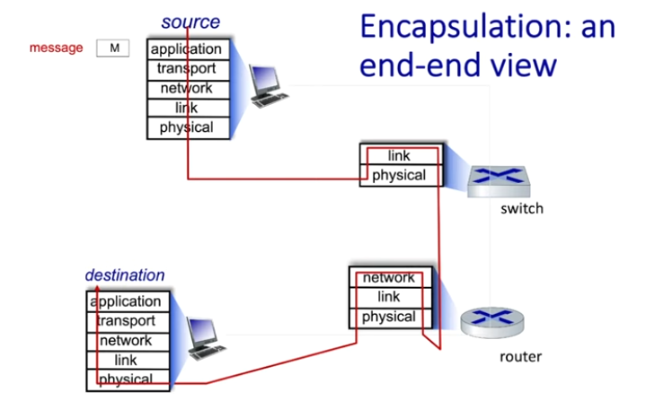

# Sumário
- [Sistemas de Autenticação](#sistemas-de-autenticação)
- [Sistemas de Autorização](#sistemas-de-autorização)
- [Desenvolvimento Web Enxuto](#desenvolvimento-web-enxuto-)
- [O Poder do HTML](#o-poder-do-html-)
- [Single-page Applications - SPAs](#single-page-applications---spas)
- [Multi-page Applications - MPAs](#multi-page-applications---mpas)
- [Hypermedia-Drive Application - HDA](#hypermedia-drive-application---hda-️)
- [Desenvolvimento Enxuto na Prática](#desenvolvimento-enxuto-na-prática-)
- [Bibliotecas](#bibliotecas-)
- [fetch API](#fetch-api)
- [Runtimes](#runtimes-️)
- [Gerenciadores de Pacotes](#gerenciadores-de-pacotes)
- [Getting Real](#getting-real-️)

# Sistemas de Autenticação
Autorização, às vezes identificada como `authz`, tem alta relação com a [Autorização](#sistemas-de-autorização), podendo ser confundida com ela. Entretanto, elas têm conceitos diferentes. Sumariamente, authz é responsável por _permissões_, enquanto que authn é responsável por _identidades_.

Autenticação, também chamada de `authn`, significa confirmar a identidade do cliente (pessoa ou do sistema externo) que está fazendo a requisição, com o intuito de não expor dados a alguém não autorizado. Tal confirmação pode ser feita com um ou mais parâmetros dentro de três opções diferentes: 
- algo que o cliente é, p. ex., a íris, a biometria, a voz;
- algo que o cliente possui, p. ex., um dispositivo que recebe um token; ou
- algo que o cliente sabe, p. ex., username e senha.

O Oauth 2.0 é um protocolo de autenticação amplamente utilizado. Basicamente, o usuário é direcionado para um serviço terceirizado para ser autenticado, e depois ele é redirecionado novamente para a aplicação. Então é disponibilizado um token para o usuário, o que permite a requisição de recursos em nome do usuário.

# Sistemas de Autorização
A Autorização determina o que um cliente autenticado pode acessar e executar. Um usuário de um banco online, por exemplo, após confirmar sua identidade, pode visualizar seu extrato, seu saldo entre outros dados, porém ele não tem permissão para visualizar os dados de outros usuários.

Os padrões de autorização mais conhecidos são RBAC, ReBAC e ABAC, a seguir, uma breve explicação de cada:
- RBAC (Role Based Access Control): a permissão está atrelada à função do cliente. A cada usuário é atribuída uma função que possui um conjunto de permissões. Desvantagens: pouco flexível, não comporta um número de funções muito grande. É muito utulizado por ser simples de entender e implementar.
- ReBAC (Relationship Based Access Control): é uma solução um pouco mais complexa. As permissões são atribuídas de acordo com as relações entre o usuário e `objeto`, ou entre `objeto` e `objeto`; desse modo, é melhor para lidar com estruturas hierárquicas. Para implementar, é preciso criar papéis para recursos específicos, dessa forma, o papel e sua função são relevantes apenas no contexto daquele recurso específico.

<div align="center"></div>

- ABAC (Attribute Based Access Control): distribui permissões de acordo com avaliação de _atributos_ dos usuários, do ambiente e dos recursos. Isso possibilita maior dinâmica e flexibilidade. Desvantagens: difícil de implementar e manter, impacto no desempenho do sistema por conta da avaliação de políticas de atributos.


# Desenvolvimento Web Enxuto 🌐🧽
O Desenvolvimento Web Enxuto é um movimento que preza pelo domínio de conhecimentos básicos para desenvolver interfaces de usuário de modo simples, porém robusto para a web. Em outras palavras, esse movimento busca priorizar HTML e CSS, em detrimento de bibliotecas e frameworks JavaScript, reduzindo a quantidade de dependências nos projetos.

## O Poder do HTML 👊🦸
O HTML5 (HyperText Markup Language 5) é uma linguagem de marcação que permite a interação [_hipermídia_](https://htmx.org/essays/when-to-use-hypermedia/), isto é, a construção de páginas com hipertexto e multimídia. 

Para esclarecer, hipertexto é a leitura não linear de arquivos de texto. Já multimídia é o conjunto de diferentes tipos de mídia disponíveis na web, como arquivos de áudio e de vídeo. Nesse sentido, a hipermídia obtém êxito no atendimento da maioria das necessidades dos sistemas para web, pois é descomplicada, otimizável e dá mais liberdade à escolha de tecnologias para o server-side.

Apesar disso, existe uma discussão sobre a escolha entre a hipermídia e um [SPA](#single-page-applicationtions---spas) (Single-page Applicationtion). Tal decisão depende das singularidades de cada projeto, todavia o movimento em questão defende que a hipermídia é suficiente para grande parte dos problemas solucionados com sistemas web.

Dentre as principais motivações para optar pela hipermídia, estão: 
- A interface de usuário é composta por texto e imagens predominantemente;
- A interface consiste em formulários que devem ser preenchidos e ter seus dados armazenados em bancos de dados.
- A UI (interface de usuário) tem atualizações aninhadas, ocorrendo em blocos definidos. 
- A página precisa de deep-links – links que direcionam para um conteúdo específico dentro de uma página.

No entanto, utilizar somente a hipermídia pode não ser uma boa ideia nos seguintes casos: 
- A UI tem muitas dependências dinâmicas, isto é, dependência de informações que não podem ser determinadas na renderização, no server-side;
- O sistema precisa ser totalmente funcional quando offline. 
- A UI é atualizada com extrema frequência.
- É necessária a integração com componentes _copy & paste_, que, aliás, são projetados para frameworks frontend específicos.

Nessa perspectiva, surge então o [HATEOAS](https://htmx.org/essays/hateoas/) (Hypermedia as the Engine of Application State), que é um tipo de arquitetura de API REST. Nela, clintes da API podem fazer seu consumo por meio de links (hipermídia), sem ter conhecimento prévio sobre ela, ou seja, sem saber qual é a URL. Além disso, ele dispensa a prática de implementar regras de negócio no client-side, todavia é melhor aplicável em operações de CRUD somente.

### Single-page Applications - SPAs


Um SPA é um modelo de implementação que carrega apenas um documento web e que, quando precisa mostrar um conteúdo diferente, atualiza o body desse único documento via APIs JavaScript, como o [Fetch](https://developer.mozilla.org/en-US/docs/Web/API/Fetch_API). A vantagem disso é que usuários podem usar sites sem precisar carregar páginas vindas do servidor, o que gera performance e uma experiência mais dinâmica.

Contudo, o SPA também apresenta alguns pontos negativos que devem ser levados em consideração, por exemplo:
- Demanda frameworks JavaScript muito carregados;
- Nem sempre a performance é beneficiada;
- Pode haver muitos bugs; e
- Apresenta problemas de acessibilidade, dentre outros entraves.

Vale citar aqui os principais frameworks que permitem a implementação de SPAs:
- [React](https://react.dev/): biblioteca JavaScript para criação de componentes de UI, tanto para apps nativos (designados para um tipo específico de sistema operacional), quanto web. Ele faz CSR (Client-Side Rendering).
- [Angular](https://angular.dev/guide/routing/router-tutorial): é uma plataforma, desenvolvida em typeScript, mantida pela Google. Oferece base de componentes para aplicações web escaláveis, várias bibliotecas e ferramentas que auxiliam a codificação.
- [Vue](https://vuejs.org/guide/extras/ways-of-using-vue#single-page-application-spa): é um framework JavaScript para UIs. Suas principais features são: renderização declarativa (cliente-site rendering) e reatividade (sobre alterações de estado JS). 
- [Vite](https://vite.dev/guide/why.html): é uma ferramenta de build que busca agilizar a inicialização do servidor de desenvolvimento. Permite a separação de programas JS em módulos reutilizáveis, faz transpilação de TS para JS, é mais simples e rápido do que o [Webpack](https://webpack.js.org/), é independente de outros frameworks.

### Multi-page Applications - MPAs


MPA é um modelo de implementação de sistemas web que faz um carregamento completo da página a cada requisição.

Diferenciais de um MPA:
- Melhor implementação de técnicas de SEO;
- Carregamento ágil na inicialização;
- Oferece maior facilidade para manutenção e escalabilidade. 

Convém listar ainda algumas desvantagens dos MPAs:
- Não é possível rodar vídeos de forma ininterrupta.
- Botão de voltar e scroll infinito não são viáveis.
- As bibliotecas JavaScript são recarregadas a cada requisição.
- Geralmente, apresentam problemas de latência.

Nesse sentido, [SSR](https://www.patterns.dev/react/server-side-rendering/) (Server-Side Rendering) é uma alternativa para renderização de conteúdo web. Ele gera todo o HTML para que a página seja renderizada em resposta a uma requisição (do usuário). A maior parte das coisas como conexões e fetchs são resolvidas no server-side, inclusive o HTML para formatar o conteúdo a ser exibido, para que posteriormente possa ser enviado ao client-side. Nele, cada requisição é tratada de modo independente, sendo processada e gerada pelo servidor do zero, o que pode deixar a aplicação mais lenta se for utilizada por muitos usuários com muita interatividade.

Alguns frameworks que utilizam SSR para construção de MPAs são: 
- [Next.js](https://nextjs.org/): este é um framework React para implementação de aplicações fullstack. Com ele, pode-se implementar tanto o SSR, quanto o CSR. Além isso, o framework oferece suporte para TypeScript, layouts, roteamento aninhado, estados de carregamento, e entre outros.
- [Astro](https://astro.build/): trata-se de uma plataforma que permite a geração de sites estáticos. Ele renderiza o site para HTML e CSS, reduzindo a quantidade de javascript enviada para o client-side (SSR). Além disso, tem a arquitetura de ilhas (island architecture), o que também é chamado de hidratação parcial. Isso consiste em tratar componentes de uma página como ilhas de interatividade, que podem ser hidratadas de maneira independente.

### Hypermedia-Drive Application - HDA ♻️
A arquitetura HDA é uma combinação entre MPA e SPA. Isso é possível graças a uma extenção da infraestrutura HTML da web. Ademais, implementa o HATEOAS. Tem duas características principais:
- Utilização de HTML declarativo na interatividade humano-computador, ao invés de código imperativo.
- Interage com o servidor, em termos de hipermídia, ao invés de utilizar um formato não hipermídia como o JSON.

[Neste link](https://hypermedia.systems/extending-html-as-hypermedia/) pode-se compreender como é a extensão da infraestrutura HTML na prática.

### Desenvolvimento Enxuto na Prática 📝
> "Choose the least powerful language suitable for a given purpose". 

Essa frase resume o princípio de que, ao longo da construção de sites, se uma linguagem ou tecnologia mais simples – como HTML ou CSS – resolve o problema, não devemos tentar resolvê-lo com algo mais complexo e pesado – como JavaScript.
- [Neste vídeo](https://www.youtube.com/watch?v=IP_rtWEMR0o), kilian Valkhof mostra várias exemplos práticos de problemas que geralmente são resolvidos com JavaScript, mas que podem ser resolvidos eficazmente com HTML e um pouco de CSS. 

Sugere-se a seguinte linha de raciocínio ao longo da solução:
   1. É possível resolver com HTML?
   2. Se não, isso pode ser solucionado com CSS?
   3. É possível melhorar a estilização para que fique mais fácil de implementar?
   4. Se não for, nessa situação pode-se utilizar um pouco de JavaScript.
   5. Em último caso, será necessário adicionar uma dependência.

Nesse âmbito, é importante iniciar tratando o HTML com seriedade. Isso porque usualmente tal linguagem é pouco apreciada, talvez por ser _onipresente_ ou simples, o que não suprime o seu poder. No princípio, enquanto a maioria das pessoas estavam ocupadas aprendendo e aplicando o React em seus sistemas, instituições com W3C, WHATWG, IETF e TC39 continuaram aprimorando as linguagens nativas dos navegadores, que inclusive atendiam boa parte dos motivos para se usar o React. 


### Bibliotecas 🔍🪜
Para começar a praticar o desenvolvimento web enxuto, sugere-se o conhecimento das bibliotecas listadas a seguir:
  - [HTMX](https://htmx.org/): dá acesso a vários atributos, que são incluídos no HTML, permitindo a construção de interfaces poderosas e simples com hipertexto. [_AQUI_](https://htmx.org/examples/) há links para demonstrações de coom aplicar o htmx em vários problemas muito comuns.
  - [Alpine.js](https://alpinejs.dev/): refere-se a um framework JavaScript mais leve, para criação de componentes interativos, que também pode ser utilizado diretamente dos arquivos de marcação. Ele busca oferecer flexibilidade, simplicidade e componentes dinâmicos.
  - [Stencil](https://stenciljs.com/): biblioteca para desenvolvimento de componentes reutilizáveis e escaláveis. Suas de maior destaque são: componentes compatíveis com qualquer browser; bom desempenho; compatibilidade com vários frameworks; geração automática de documentação; suporte a TypeScript.
  - [Lit](https://lit.dev/): oferece web components – assim como o Stencil, porém mais minimalista –, atualização automática dos componentes quando os atributos mudam; templates declarativos; interoperabilidade; estilos separados em escopos; entre outros.

### fetch API
- Oferece uma interface para busca de recursos em qualquer URL de API.
- Usa os objetos `request` e `response`.
- Recebe como argumento o caminho para o recurso que se deseja buscar (`resource`) e um argumento opcional com configurações da solicitação.
- É uma função assíncrona, ou seja, retorna uma `resolve` quando a `response` está pronta.
- Serve como alternativa ao `XMLHttpRequest`.

# Runtimes 🏃‍♀️🕐
Um *Runtime* pode ter conceitos diferentes, de acordo com o contexto, todavia aqui, *runtime* é um ambiente de desenvolvimento, uma infraestrutura, abrangendo software e hardware, capaz de executar um código fonte em tempo real. O runtime carrega aplicações requisitadas para a execução do programa em uma plataforma, que possibilita isso de maneira independente do sistema operacional.

Sua importância está na necessidade de providenciar uma estratégia para adaptar um mesmo código em vários sistemas operacionais apesar de suas diferenças. Além disso, runtimes podem facilitar a execução, fornecendo bibliotecas e funcionalidades adicionais.

Há alguns tipos de runtime, como o JRE (Java Runtime Environment), para aplicações Java, o CLR (Common Language Runtime), para aplicações .NET, e o Node.js, para aplicações JavaScript.

A maioria das linguagens de programação precisa de um ambiente runtime, entratanto existem runtimes de alto nível e de baixo nível. Linguagens com C e C++ não demandam um runtime de alto nível para serem executadas, pois o arquivo binário gerado pelo compilador pode ser executado diretamente pelo sistema operacional. 

## Comparação de Runtimes para JS


Para códigos em JavaScript, podemos citar como exeplos três runtimes. Eles executam código JS fora do navegador, utilizado principalmente quando aplicado no server-side:
- 🟩 **Node.js**: foi lançado em 2009, é o mais utilizado e mais antigo runtime open-source para JavaScript. Dentre os três aqui citados, é o que tem menor performance, porém maior suporte, comunidade e opções de implantação. Ele é suportado por maior parte dos servidores em nuvem.  
- 🐱‍🐉 [**Deno**](https://deno.com/): surgiu com o fito de resolver algumas questões identificadas no Node.js. Oferece suporte para carregamento de dependências via URLs e TypeScript integrado. Entre os três, possui maior segurança e vquantidade de ferramentas. No entanto, não disponibiliza armazenamento integrado. Nessa linha, é importante mencionar que ele é ótimo para o contexto do estágio porque sua configuração para uso é rápida e fácil, o que é ideal para um desenvolvedor iniciante.
-  🧅 **Bun**: surgiu em 2021, sendo um runtime que foca na experiência do programador e na performance. O Bun se destaca por sua performance, armazenamento embutido com SQLite e interoperabilidade – permite comunicação entre diferentes sistemas. Sua aspecto negativo é que ainda não possuir opções de implantação.

## Mais sobre o Deno ➕
- Para criar timers para funções serem executadas em outro momento, com javascript. Neste exemplo, o console mostra a mensagem após 1000 milisegundos. `setTimeout(() => console.log("Hello, World!"), 1000);`. Também é possível criar intervalos para um função ser repetida a cada período de tempo: `setInterval(() => console.log("Hey!"), 1000);`.

- Existe a possibilidade de mostrar cores! Neste exemplo, a mensagem aparece vermelha: `console.log("%cHello World", "color: red");`. Para mudar a cor do background no terminal: `console.log("%cHello World", "background-color: blue");`.

- É simples conectar o projeto à OpenAI e interagir com a inteligência artificial. [Veja aqui](https://docs.deno.com/examples/openai-chat-completion/).

- Para fazer um servidor HTTP que mostra `Hello world`. Rode o comando `deno run --allow-net https://docs.deno.com/examples/http-server.ts` no terminal ou:
 
 ```typescript
    function handler(_req: Request): Response {
        return new Response("Hello, World!");
    }

    Deno.serve(handler);
 ```

- Para fazer uma requisição para um servidor HTTP: teste no terminal `deno run --allow-net https://docs.deno.com/examples/http-requests.ts`. Ou leia mais [aqui](https://docs.deno.com/examples/http-requests).

# Gerenciadores de Pacotes
São ferramentas que automatizam a gerência, instalação e compartilhamento de pacotes, que são as dependências de um projeto. Usar um gerenciador de pacotes garante que não haja arquivos conflitantes e ausênica de dependências.

## NPM (Node Package Manager)
O NPM é o gerenciador de pacotes padrão da runtime [Node.js](#comparação-de-runtimes-para-js). Ele é simples de usar, tem uma comunidade grande e ativa, porém tem grandes problemáticas, algumas delas são:
- Instalação sequencial de pacotes, o que aumenta o tempo de instalação;
- `npm audit`. [Nesta página](https://overreacted.io/npm-audit-broken-by-design/) uma pessoa muito frustrada explica porque isso é um problema.
- Erros graves que assustam, e que seriam possíveis apenas se um invasor tivesse total acesso a sua máquina.

<div align="center"></div>

## PNPM (Performant Node Package Manager)
Este é outro gerenciador de pacotes também do ambiente `Node.js`, todavia é uma alternativa mais eficiente. Seu diferencial é não baixar bibliotecas completas, mas somente as diferenças entre versões. No console, ele mostra quantos pacotes e quanto espaço de disco foram economizados. 

Uma desvantagem que ele apresenta é não suportar todos os pacotes possíveis.

# Getting Real ⬛️🔳
The smarter, faster, easier way to build a successful web application.

## Introdução
- Getting Real é sobre ser sucinto e ágil;
- O objetivo é atacar os problema reais, e não aquilo que você acha que é o problema.
- Para superar seus adversários, faça menos do que eles — menos features, opções, pessoas, reuniões, abstrações  e promises.

## The Starting Line
- Aprender a lidar com recursos limitados desde o início vai ensinar a 
- É melhor fazer uma entrega excelente com um pouco menor do que o previsto do que lançar um negócio medíocre, bugado, porque você tentou muito alcançar um prazo, um orçamento e um escopo maravilhosos.
- Uma forma de conseguir entregar dentro do prazo e do orçamento é mantendo eles muito fixos, sem jamais dilatá-los ou reduzí-los.
- É quase impossível realizar uma entrega atendendo o prazo, o orçamento e o escopo definidos inicialmente.
- É melhor definir expectativas do que tempo, orçamento e escopo.
- Para saber o quê seu app deve ser é uma boa descobrir primeiro _o quê ele **não** deve ser_.
- A Basecamp decide que a gerência de projetos não é sobre gráficos, quadros ou estatísticas, mas sobre ***comunicação***.

## Stay Lean
- No mundo da tecnologia, as mudanças devem ser algo fácil e barato de se fazer. Se não for assim, você perde terreno para quem conseguir antes.
- Coisas que deixam o projeto mais massivo e inflexível: contratos muito longos; trabalho excessivo; decisões permanentes; reuniões demais; processo rígidos demais; inventário, bloqueios de hardware, software e tecnologia; formatos de dados proprietários; o passado governando o futuro.
- Coisas que reduzem o peso: pensamento just-in-time; membros multi-tasking no time; abraçar as restrições, ao invés de carregá-las; menos software, menos código; times pequenos; menos features; simplicidade; produtos open-source; dados de formato aberto; uma cultura aberta que dê abertura para reconhecimentos de erros.
- Ser uma empresa pequena pode, na verdade, ser uma enorme vantagem frente à conconrrẽncia.
- Organizações menores são mais próximas do cliente, por default.
- Escreva um mantra para seu produto, isto é, uma frase de 4 ou 5 palavras dizendo por que ele existe.
- Sucesso e satisfação estão nos detalhes.
- Você não deve se importar com os detalhes logo de início. Isso é algo que se aprende com a prática do desenho. Se você já começa o desenho tentando atender os detalhes, pode ter certeza que o desenho vai ficar ruim.
- Uma equipe de 3 pessoas é ideal para fazer a versão 1.0 de um produto. Uma delas é dev, a outra é designer, e a outra fica oscilando entre os dois.

## Priorities
- Muitas pessoas perdem tempo tentando resolver problemas que elas ainda não possuem. 
- Não se preocupe com a escalabilidade do seu app web logo de cara, a esmagadora maioria (overwhelming majority) não será utilizada por um milhão de pessoas nem tão cedo.

## Feature Selection
- Não vá atrás de pessoas que você nunca será capaz de agradar. Isso porque os melhores sistemas têm uma visão, assumem uma posição, uma abordagem.  
- Selecione apenas metadas das features que você gostaria para seu app.
- A maior parte do tempo que você tem, você gasta com coisas que realmente não têm importância.
- Toda vez que você diz "sim" para uma feature, você está adotando um filho.
- Inovação é sobre saber dizer NÃO para tudo, exceto às features mais cruciais.
- Tem um passo-a-passo legal para seguir: 

> For every new feature you need to…
1. Say no.
2. Force the feature to prove its value.
3. If “no” again, end here. If “yes,” continue…
4. Sketch the screen(s)/UI.
5. Design the screen(s)/UI.
6. Code it.
7-15. Test, tweak, test, tweak, test, tweak, test, tweak…
16. Check to see if help text needs to be modified.
17. Update the product tour (if necessary).
18. Update the marketing copy (if necessary).
19. Update the terms of service (if necessary).
20. Check to see if any promises were broken.
21. Check to see if pricing structure is affected.
22. Launch.
23. Hold breath.

- Ofereça somentes serviços e benefícios que você é capaz de manter financeiramente, estrategicamente e organizacionalmente.
- Pense na possibilidade de dar abertura para as pessoas usarem criatividade e resolverem seus próprios problemas por meio de adaptação, ao invés precisar de mais uma funcionalidade na aplicação.

- Frase do Steve Jobs a seguir:
> [Innovation] comes from saying no to 1,000 things to make sure we don’t get on the wrong track or try to do too much. We’re always thinking about new markets we could enter, but it’s only by saying no that you can concentrate on the things that are really important.

- Isso aqui é legar para usar na aplicação do chat.
> “Why don’t you allow bold or italic or colored formatting in the chats?” Answer: It just doesn’t matter. If you need to emphasize something use the trusty caps lock key or toss a few *’s around the word or phrase. Those solutions don’t require additional software, tech support, processing power, or have a learning curve. Besides, heavy formatting in a simple text-based chat just doesn’t matter.

## Process
- Passo a passo para usar o Get Real:
1. Brainstorm;
2. Paper sketches;
3. Create HTML screens;
4. Code it.

- _Getting Real is all about being able to change on the fly._
- Ficar dando opções de customização pro usuário tem custo alto. Cada nova opção tem um custo e um prazo extra demandado.
- Decisões são temporárias.
- O melhor teste que existe é o teste de usuário, porque se tem uma coisa que as pessoas gostam de fazer de graça é criticar.
- Após decidir se realmente vale a pena execute, e execute rápido. Imperfeito, mas rápido. Então, publique e veja o que as pessoas dizem.
- Se você estiver enfrentando uma issue que parece muito grande, muito difícil, quebre-a. E continue quebrando ela em pedaços menores. 
- So, give a programmer three weeks to complete a large task, and she’ll spend two and a half procrastinating, and then one programming. Pegar uma tarefa menor para fazer, com um prazo também menor, é muito mais gerenciável e fazível.
- Quando algum infeliz vier te abordar com uma pergunta difícil, mas querendo uma resposta definida, tipo de prazo, custo etc
 
> To make a business, you need to multiply the two.
> Explanation:
- Awful idea = -1
- Weak idea = 1
- So-so idea = 5
- Good idea = 10
- Great idea = 15
- Brilliant idea = 20

- No execution = $1
- Weak execution = $1000
- So-so execution = $10,000
- Good execution = $100,000
- Great execution = $1,000,000
- Brilliant execution = $10,000,000

## The Organization
- As pessoas geralmente preferem trabalhar bem cedo de manhã, ou bem tarde de noite. 
- Para terminar as coisas, você precisa de um longo tempo sem ser interrompido.
- Evite reuniões a todo custo. Geralmente, elas surgem quando um conceito não está claro o suficiente, então, tente explicá-lo de forma mais simples por texto mesmo.
- Quando fazer uma reunião? R.: Only book a meeting when you have an important business issue to discuss and you want or need input, approval, or agreement. 
- Você não precisa de tantos funcionários quanto você pensa.
- Lei de Brooks': Adding people to a late software project makes it later.

## Staffing
- É melhor ter poucos devs, mas devs muuuito bons, do que ter um monte de devs medianos.
- Características a serem analisadas ao buscar alguém para contratar: 
    - Obs.: antes de mais nada, o livro manda buscarmos pessoas através do ecossistema open source.
    - Qualidade do trabalho;
    - Perspectiva cultural;
    - Nível de paixão;
    - Percentual de conclusão das coisas;
    - Match social;

- Eles contratam apenas pessoas que eles conhecem através do open source.
- Não é legal contratar pessoas com habilidades específicas demais demais.
- Para times pequenos, precisamos de pessoas _capazes de usar chapéus diferentes_.
- Entusiasmo é um atributo que você simplesmente não consegue fingir.

> Clear writing leads to clear thinking. You don’t know what you know until you try to express it. Good writing is partly a matter of character. Instead of doing what’s easy for you, do what’s easy for your reader.

- Abaixo, uma coisa que eu discordo muito, mas o pessoal da Basecamp acredita:
> What you want the most from a new hire is passion for what he does, and there’s no better way of showing it than a trace of commitment in open source projects.

## Interface Design
- Não é uma boa ideia começar um projeto só com um programa em mente. É começar com um protótipo, um desenho, porque é flexível e mais "concreto", de certa forma.
- Nesse desenho inicial, você deve ignorar algumas coisas que não estão no epicentro, p. ex.: abas, navegação, rodapé, cores, barra lateral, logo, etc. Você deve começar desenhando aquilo que é mais importante para a aplicação. 
- Para cada tela, você deve considerar três estados possíveis: 
    - Regular: a tela que as pessoas veem quando tudo está funcionando bem e seu app está alimentado com os dados. É nesta tela que você vai gastar mais tempo planejando.
    - Blank: a tela que as pessoas ao usar o app pela primeira vez, antes dos dados serem inseridos; É a primeira impressão do seu app.
    - Error: a tela que as pessoas veem quando algo dá errado.
- Design defensivo: sue app pode funcionar muito bem em 90% das vezes, mas se seu usuário for abandonado quando mais precisar, ele jamais vai esquecer.

## Code
- Sempre busque manter seu código o mais simples possível.
- A complexidade do código aumenta exponencialmente conforme você aumenta a quantidade de código.
> Less software means less features, less code, less waste.
- Escolha ferramentas que mantenham a equipe animada e motivada. Um programador feliz é um programador produtivo.
- Se programador fosse pago pra apagar código, ao invés de escrever mais, o mundo seria melhor.

## Words
- Especificações funcionais são fantasia.
- As pessoas concordam e assinam um monte de parágrafos, mas cada uma está imaginando algo diferente na cabeça.
- Especificações Funcionais (escritas) te obrigam a tomar várias decisões importantes quando se sabe o mínimo sobre a aplicação. 
- Especificações não lidam com a realidade de que, quando você começa a construir, tudo muda.
- O que você pode fazer no lugar é o seguinte: começa a escrever uma história sobre o quê o app deve fazer. Se isso te tomar mais de um dia e mais de uma página, então está complexo demais; simplifique. Em seguida, comece a desenhar uma interface. Crie uma interface que todos possam clicar, usar e sentir realmente antes de começar a pensar em código de backend. 
- Esqueça de documentos de requisitos grandes e fechados. Eles te forçam a fazer decisões muito importantes cedo demais.
- É a pior maneira de escrever software, porque, por definição, significa que o software foi escrito para corresponder à teoria, não à realidade.
- A menos que um documento realmente vá se transformar em algo real, não o produza.
- Se precisar explicar algo, tente mockar ao invés de escrever, porque um protótipo está muito mais suscetível a se tornar algo real do que um parágrafo.
- Se ainda assim você acha que uma feature está precisando de palavras para ser explicada, escreva uma pequena história sobre. Não coloque detalhes técnicos, apenas conte a história rapidamente como se você estivesse numa conversa normal.
- Coloque texto real ao invés do lorem ipsum para realizar testes porque não é isso que o seu usuário fará de verdade.

## Pricing and Signup
- Sempre que você realizar uma mudança no seu app, pergunte-se se essa mudança está de acordo com a "personalidade" que você quer que seu app tenha.
- Oferecer brindes é uma ótima forma de atrair clientes.
- A assinatura de um plano e seu cancelamento devem ser possíveis sem dificuldades.
- Evite contratos longos e difíceis.

## Promotion
- [Hollywood Launch](https://basecamp.com/gettingreal/13.1-hollywood-launch)
- Coisas para colocar na ladding page: overview, tour, screen captures and videos, manifesto, case studies, buzz, forum, pricing e sign up, weblog.
- Blogs podem ser mais efetivos do que anúncios.
- Dê um jeito de coletar emails.
- Compartilhe seu conhecimento com o mundo. Isso te posiciona como expert na indústria.
- Dê um nome fácil de lembrar para seu app. O nome tem que ser curto, catchy e lembrável.
- É legal que o produto seja **fácil de descrevers, fácil de usar e fácil de comprar**. Isso tudo implica que o produto é **fácil de vender**.

## Support
- O suporte está para a garçonete, assim como os devs estão para o chef de cozinha.
- No entanto, acaba que o time de devs fica sem contato com os clientes. Isso é ruim porque interagir com os clientes é a melhor forma de descobrir os pontos fortes e os pontos fracos do seu produto. Em virtude disso, é interessante quebrar as barreiras entre o cliente e os devs. Você e todo seu time devem saber o que seus clientes estão dizendo.
- Sempre responda muito rapidamente as queixas de seus usuários. Isso pode te destacar no mercado.
- Crie um fórum para seus usuários se ajudarem.
- Se acontecer algum bug terrível que derrube tudo temporariamente, seja transparente e honesto e avise teus usuários. Um usuários bem informado é seu melhor usuário.

## Post-Launch
- Mantenha um blog após lançar teu produto. Você pode manter: FAQs, How-tos, tips and tricks, new features, updates, and fixess, and buzz/press.
- Manter esse blog faz sua empresa parecer mais **_humana_**. 
- Perguntas a responder para categorizar uma prioridade para seus bugs: _How many people are affected? How bad is the problem? Does this bug deserve immediate attention or can it wait? What can you do right now that will have the greatest impact for the greatest number of people?_.
- Bugs acontecem; aceite. Não precisa ficar procurando um culpado.
- Siga, acompanhe as publicações de sua concorrência.
- Em caso de alguma reação impulsiva, isto é, alguma resposta muito negativa, espere um pouco e esteja calmo para responder com tranquilidade.

## Conclusion
- Sucesso é sobre uma excelente execução.
- Você não pode apenas ter uma boa escrita e ainda assim falhar em cumprir as promessas em sua narrativa.


