# Introdução a Bancos de Dados 🪑🎲

Bancos de dados compõem um conjunto de dados relacionados organizados em um sistema computacional e administrados por um Sistema de Gerenciamento de Banco de Dados (SGBD). Eles são utilizados para armazenar dados ou informações para serem consultados ou alterados posteriormente.

Bancos de dados podem ser:
- **Relacionais**: quando o conjunto de dados pode ser totalmente encaixados em uma tabela com linhas e colunas. 
- ou **Não relacionais**: quando os dados são flexíveis e não seguem um padrão, ou são muito grandes, de modo que organizá-los em linhas e colunas é ineficiente.

---
### Propriedades ACID 🧪

Uma `transação` é um conceito fundamental, definido como uma unidade de execução de programa que tem o propósito de buscar e atualizar diversos itens de dados. Para que uma transação seja efetuada, é necessário seguir todas as propriedades ACID, esclarecidas abaixo:
- **Atomicidade**: geralmente uma transação é composta de multiplas ações. Nessa perspectiva, a atomicidade garante que a transação será tratada como algo unitário, de modo que ou ela é completada, ou falha por completo. Em outras palavras, se qualquer detalhe da transação falhar – como falta de energia, por exemplo –, a transação é totalmente abortada e o estado do banco de dados permanece o mesmo.
- **Consistência**: garante que, após a transação, o banco de dados mudará de um estado válido para outro estado também válido, consistente. Isso ocorre a partir da definição de restrições, cascades, triggers, dentre outras regras.
- **Isolamento**: certifica que múltiplas transações poderão ocorrer simultaneamente, seguindo os outros três princípios ACID, sem que uma transação interfira na execução de outra.
- **Durabilidade**: é confirmar que, uma vez que a transação foi solicitada, mas não pode ser completada, todas as atualizações de outras transações não são perdidas.


---
### Exemplos de SGBDs

A seguir, são explorados alguns SGBDs selecionados, porém no site [dbdb.io](https://dbdb.io/) é possível obter maiores detalhes acerca de inúmeros SGBDs.
Para escolher um deles, é preciso levar em consideração aspectos como os tipos de dados que serão armazenados, a quantidade de recursos financeiros disponíveis para tanto, os objetivos com o banco de dados e a capacidade do SGBD.

#### PostgreSQL 🐘

É um banco de dados Objeto-Relacional open-source, desenvolvido pela University of California de Berkeley, na linguagem C de programação. 
Suporta *Materialized view*, *virtual view*, funções armazenadas, *triggers*, e foreign keys. Cobre operações a nível de transação, linguagem de definição de dados e de manipulação de dados, criação de funções e procedimentos. Todavia não oferece suporte a compilação de consultas. O postgreSQL é recomendado para aplicações empresariais com cenários rigorosos, tais como finanças, telecominicações e ERP (Planejamento de Recursos Empresariais). Seus benefícios incluem permitir escalabilidade, ter uma comunidade ativa, ser fácil de operar e de manter.

#### SQLite 📜✒

Mecanismo de Banco de Dados autocontido, integrado, completo, de domínio público e alta confiabilidade. O SQLite foi lançado nos anos 2000 por D. Richard Hipp quando ele estava trabalhando para a marinha dos Estados Unidos em um software de mísseis explosivos. Como o nome já sugere, este é um banco de dados mais simples que os demais, não sendo direcionado para dados empresariais, com alto volume e concorrência. Na realidade, ele pretende prover dados armazenados localmente para aplicações e dispositivos individuais, enfatizando economia, eficiência, autonomia e simplicidade.

#### MongoDB 🍃

O Mongo é um SGBD de código aberto orientado a documentos, armazenando objetos altamente tipados, logo, serve para bancos de dados não relacionais. Foi inicialmente desenvolvido pela empresa `10gen` em 2007, mas somente a partir de 2009 focou em mantê-lo. Ele é recomendado quando usuários que precisam consultar dados de tipos variádos, os dados são não estruturados, há mais flexibilidade, precisa-se de melhor desempenho e disponibilidade como prioridade. 


#### Firestone(Firebase) e Supabase 🗃🔥

O Firestone o sistema que funciona por trás do framework Firebase da Google. Trata-se de um banco de dados NoSQL em nuvem, recomendado quando exige-se alta flexibilidade dos dados e integração com os serviços da Google. 

Já o Supabase é uma alternativa ao Firebase, porém para bancos relacionais. Além de oferecer o serviço de SGBD, também permite autenticações, funções e armazenamento de mídias, tal como o firebase.

#### Redis 🔴

Redis é uma sigla para "REmote DIctionary Server", criado pelo engenheiro de software Salvatore Sanfilippo. Suporta o armazenamento de inúmeros tipos de estruturas de dados, o que é feito em sua memória. É recomendados para bancos estruturados que demandam armazenamento e processamento mais dinâmico e ágil

---
### Diagrama Entidade Relacionamento

O diagrama entidade-relacionamento pode ajudar a identificar as entidades – futuras tabelas – do banco de dados, junto de seus atributos e relacionamentos. A seguir, um pequeno exemplo, utilizando a notação pé-de-galinha.

```mermaid
    erDiagram

    VENDAS_PRODUTOS }|--|| PRODUTOS : "possuem" 
    CAIXAS ||--o{ VENDAS : realizam
    CAIXAS {
        serial id PK
        decimal fundo_troco
        datetime instante_abertura
        datetime instante_fechamento
        int operador_funcionario FK
    }

    VENDAS {
        serial id PK
        varchar forma_pagamento
        int quantidade_parcelas
        date data_venda
        decimal valor_total
        decimal desconto_total
        int operador_funcionario FK
        int caixa_id FK
    }

    VENDAS ||--|{ VENDAS_PRODUTOS : "passam por"
    VENDAS_PRODUTOS {
        serial id PK
        decimal desconto
        int numero_unidades
        int produto_id FK
        INT venda_id FK
    }
    
    PRODUTOS {
        serial id PK
        int quantidade_estoque
        date data_validade
        decimal preco_unitario
        varchar lote
        varchar nome
        varchar codigo
        varchar marca
        int categoria_id FK
    }

    PRODUTOS }|--|| CATEGORIAS : possuem
    CATEGORIAS {
        serial id PK
        varchar nome
        varchar cor
    }

    PAPEIS ||--|| CAIXAS : "podem ser"

    PAPEIS {
        serial id PK
        varchar nome
    }

    FUNCIONARIOS }|--|| PAPEIS : tem
    FUNCIONARIOS {
        varchar cpf PK
        varchar nome_completo
        date data_nascimento
        date data_contratacao
        varchar nome_usuario
        varchar senha
        int papel_id FK
    }
```




---
### Structured Query Language (SQL)
A sigla significa "Linguagem de Consulta Estruturada". Ela é utilizada para armazenar, manipular, remover, pesquisar e analisar informações em um banco de dados relacional. 

A seguir, exemplo de utilização dos principais comandos utilizados em um CRUD.

```sql
-- CREATE: para criar uma tabela
CREATE TABLE exemplo_tabela (
    id INT PRIMARY KEY AUTO_INCREMENT,
    nome VARCHAR(100) NOT NULL,
    idade INT,
    cidade VARCHAR(50)
);

-- INSERT: para inserir dados em uma tabela
INSERT INTO exemplo_tabela (nome, idade, cidade)
VALUES ('João', 30, 'São Paulo');

-- UPDATE: para atualizar dados em uma tabela
-- OBS.: NUNCA JAMAIS esqueça do WHERE!
UPDATE exemplo_tabela
SET idade = 31, cidade = 'Rio de Janeiro'
WHERE id = 1;

-- DELETE: para excluir dados de uma tabela
-- OBS.: tenha certeza do que você está fazendo!
DELETE FROM exemplo_tabela
WHERE id = 1;

-- SELECT: para consultar dados
SELECT id, nome, idade, cidade
FROM exemplo_tabela
WHERE idade > 25;

```